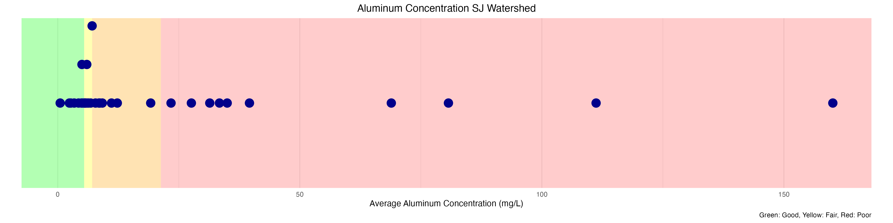

# About the App

This section provides an overview of how data is prepared before being pulled into the Shiny App, and how the app is structured.

# SJ Data Preparation

#### WQP Data
- **Project ID**: "Animas_SanJuan_Watershed"
- **Date Range**: January 1, 2015, to December 31, 2023

#### Site Flags
- **Total Sites in Watershed**: 66 sites
  - **SJ WQP Sites**: 39 sites for the Animas_SanJuanWatershed project
  - **SJ_SAP_23 Sites**: 13 sites
- Sites not in the EPA WQP list are flagged for optional filtering in the app.
- **Duplicate Sites**: 17 duplicate sites were consolidated and grouped together. Sites had exact same coordinates. EPA names were kept.
- **Original Site ID**: The original site ID is preserved in the column `MonitoringLocationID_OG`.

#### Converting All Units to mg/L
- Units of ng/L and ug/L were converted to mg/L for consistent comparisons across the watershed.

#### Not Detected Values
- Non-detect values were assigned a value of 0.5 times the Method Detection Limit Value.
- These values are flagged for optional filtering in the app.

#### Appending Hardness Values
- A hardness column was added to samples for handling calculated criteria.

#### Assigning Jurisdictions
- For sites within tribal lands, the tribe is listed as the primary jurisdiction.

   

# Shiny App/Dashboard

## Watershed Summary Tab

**Filtered Data:**
- The map reacts to filters for Sample Fraction, Non-Detect, Non-San Juan Sites, and Start/End Dates.

**Aggregated Data:**
- Filters by CharacteristicName, then groups by CharacteristicName, MonitoringLocation, and Fraction.
- Summary data is created as the mean Result Value.
- Mean result values at each site are assigned color codes based on percentiles (75th, 50th, 25th).
- The plot below shows the average Total Aluminum values and their relation to the percentiles.

## Jurisdiction Specific Criteria Tab

**Tab Filters:**
- **State**: Select one at a time
- **Parameters**: Can select multiple values
- **Sample Fractions**: Can select multiple fractions
- **Uses**: Can select multiple values
- **Date Range Filters**

**Review Map:**
- Color coded based on the average % of samples exceeding the criteria for the selected uses.
  - Yellow: Low % exceedance
  - Red: Higher % exceedance

**Exceedance Summary Table:**
- Displays the table grouped by Site, Parameter, Use, and Fraction.
- **Summary Columns**:
  - `exceed_perc`: % of samples exceeding specific use criteria
  - `sample_count`: Count of samples for specific grouping
  - `exceedances`: Count of samples exceeding criteria
  - `Mdl_concern_n`: Count of values exceeding criteria & are non-detects (assigned ½ MDL value)
  - `Missing_hardness`: Count of values missing hardness data

**Site Assessment Plots**
- Displays result values for the selected site and parameter.
- Allows toggling of use criteria lines off and on.
- Responds to selections in the exceedance table to show corresponding plots.

**Download Data Section**
- The download includes data for ALL SITES in the filtered dataset.
- The Excel (.XLSX) file has two tabs:
  - **Exceedance Summary**: Contains sample counts and exceedance values based on selected Jurisdiction, Parameter, Fractions, and Uses.
  - **Sample Data**: Includes raw data with use criteria and additional metadata.

